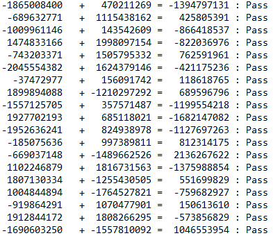
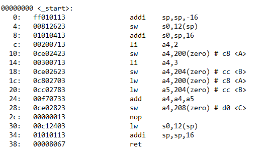
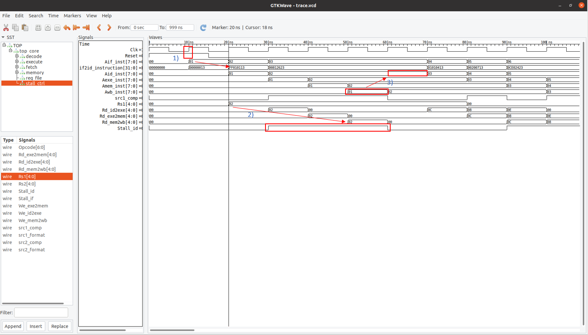
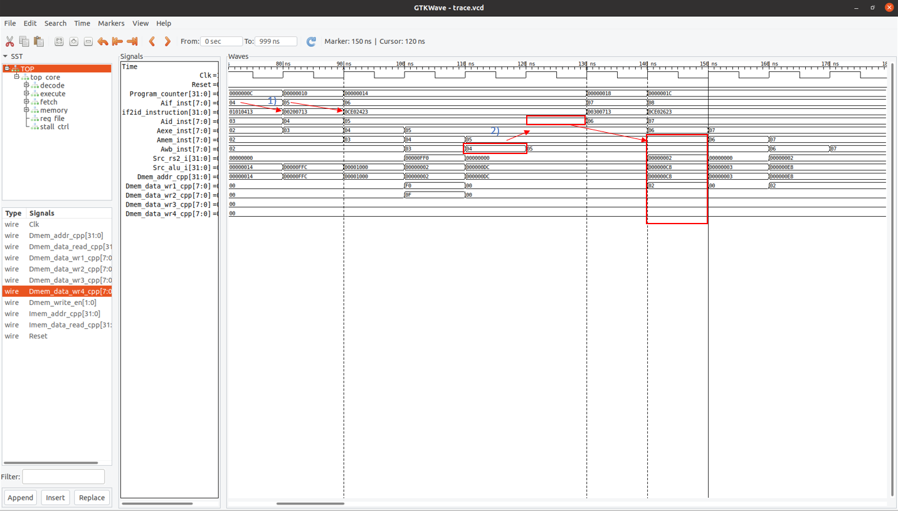
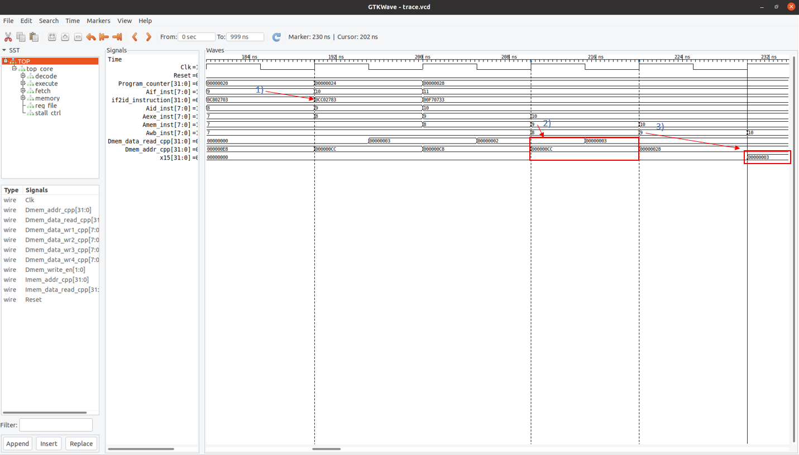
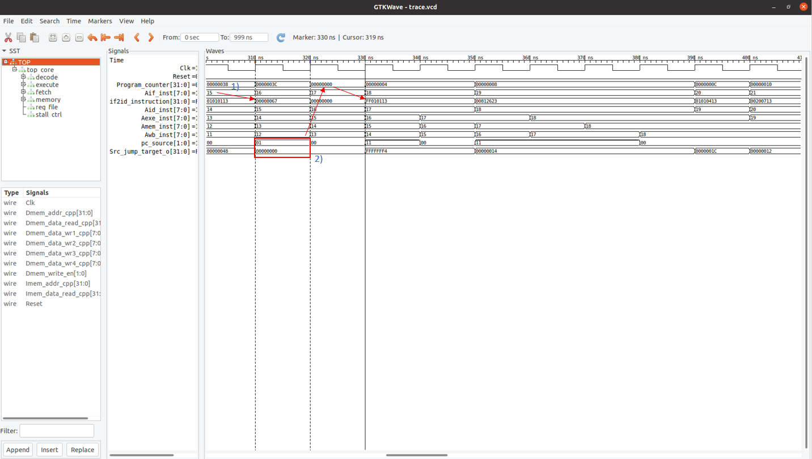

# riscv32i_w1
 <strong> About The Project </strong>   
 This is my (partially completed) first implementation of a RISCV architecture. The implementation is a 5-stage pipeline that currently only stalls during hazards. It currently has no internal instruction or data memory. I am using Verilator and a C++ wrapper to provide the core with an external "ideal 1 cycle read/write" memory for the time being. The instruction and data "memory" are split. 
 
  

 <strong> A Couple Hacks (for the time being): </strong> 
 I'm building the C program without a startup routine, implying that a) my stack pointer is uninitialized b) .data isn't properly relocated in SRAM. As a work around:
  <ul>
  <li>I'm passing arguments to objcopy in the riscv gcc toolchain to generate a .bin with padded 0's and a hard-coded relocation of .data into the memory location to match the linker script. </li>
  <li>I hard-code the stack pointer register in the register file to a non zero value during reset, instead of letting a startup routine define it.</i></li>
</ul>
  
 
  <strong> To Do: </strong> 
<ul>
  <li>Setup the compliance test suite </li>  
  <li>Implement instruction and data TCM or Cache </li>
  <li>Write a startup routine and set the memory map</i></li>
  <li>Implement some machine mode CSRs</i></li>
</ul>
  

 <strong> Project Structure </strong>  
 /Src_v contains the verilog source code. /Src_c contains the sample C program, linker script and makefile. /Testbenches contains the C++ testbench files and hosts the test executables and .vcd waveform files. /doc contains design schematics and some waveform screenshots.
 <b> ** </b> You will need to modify 'project_dir' #define in the module_top_core.cpp file in /Testbenches to provide an absolute path to this project's root directory. This is for finding the .bin executable built by the example C program, which will be located in /Src_c <b> ** </b> 
 
  

 <strong> Using My Bash Script </strong>  
  
 <ul>
  <li>Use Verilator to lint project with:<i> bash project.sh lint</i></li>
  <li>Build the sample C program with:<i> bash project.sh build</i> </li>
  <li>Verilate project, build testbench and simulate with:<i> bash project.sh simulate</i></li>
  <li>Run the ALU_i tests by changing target with:<i> bash project.sh simulate -target alu_i module_alu_i</i></li>
</ul>
 

<strong> The ALU Test </strong>  
I tested the ALU by generating random signed int values in the cpp wrapper module. The cpp wrapper performs the same ALU operations alongside the simulated verilog ALU. Both answers are compared and the result is written as a Pass or Fail to the alu_tests.txt file that generates in /Testbenches. If a test case fails, the mismatched result from the verilog ALU is also outputted. An example:

 

<strong> The sample C program </strong>  
The following is the .text section of the ELF objdump from the example C program. Below are screenshots of the waveforms generated by running the C program on the core:

 

Program entry and first hazard:
<ol>
  <li> After reset, instruction fetch stage is fetches the first instruction "ff010113" which is latched and evaluated by instruction decode stage in the following cycle. </li>  
  <li> Data dependency on the sp register (x2) between the first instruction and the second instruction. The core stalls. </li>
  <li> Instruction decode stage can proceed only after the dependency has cleared the writeback stage. </li>
</ol>

 

A store instruction and hazard:
<ol>
  <li> Instruction fetch stage is fetching instruction 4 (PC at 0x8) followed by instruction 5 (PC at 0xC). </li>  
  <li> Instruction 5 has a dependency on instruction 4 over the a4 (x14) register. Instruction 4 must commit to write back stage before instruction 5 can proceed in the decode stage in the following cycle. Instruction 5 propogates 2 more cycles into the memory stage, and the correct memory address and write data appears in that cycle. </li>
</ol>

 

A load instruction:
<ol>
  <li> Load instruction "0CC02783" (PC at 0x20) is fetched and decoded. </li>  
  <li> Mem stage sets the correct Dmem address and the "memory" responds in same cycle with the result. </li>
  <li> Result loaded from memory is commited in the writeback stage and can be seen updated in the destination register in the following cycle. </li>
</ol>

 

A jump instruction and program "exit":
<ol>
  <li> Final instruction at PC = 38 is fetched. </li>  
  <li> Decode stage recognizes a jump instruction, calculates the jump target and routes the PC source accordingly. A NOP injects into the decode stage as the fetch stage flushes and retrieves the next instruction. The jump target points back to the beginning of our program. </li>
</ol>

