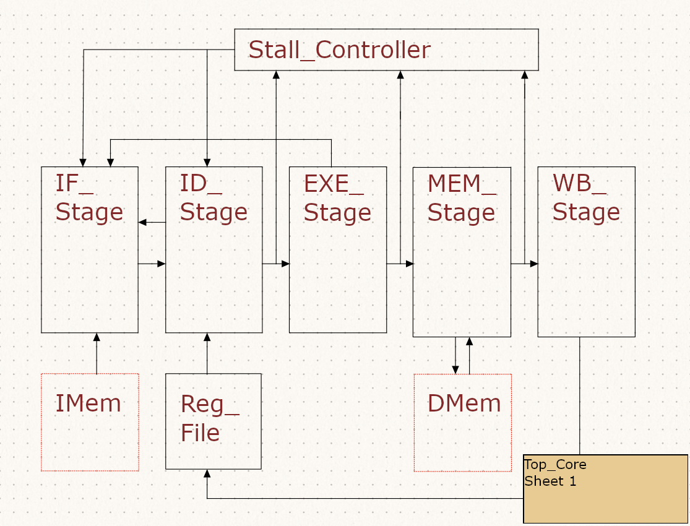

# riscv32i_w1
<strong> About The Project </strong>   
 This is my first implementation of a RISCV architecture. The implementation is 5-stage pipelined. It currently stalls during all hazards. It currently has no internal instruction or data memory. The project uses a C++ wrapper to provide the core with an external "ideal 1 cycle read/write" 2 MiB of memory. This implementation has passed the risc-v arch tests and is "RISC-V Architecture Test compliant", but has not been formally verified.

  

Full design schematics at: <a href="https://github.com/williamtien23/riscv32i_w1/blob/main/doc/documentation.md">Documentation</a> 

<strong> Prerequisites </strong>  

Install the <a href="https://github.com/riscv-collab/riscv-gnu-toolchain">riscv-gnu-toolchain</a>  
Install <a href="https://github.com/verilator/verilator">Verilator</a>  
Install <a href="https://github.com/gtkwave/gtkwave">GTKWave</a>   
Optionally clone <a href="https://github.com/riscv-non-isa/riscv-arch-test">riscv-arch-test</a> to run compliance tests 

 <strong> Project Structure </strong>  
 </ul>
  <li>/Src_v contains the verilog source code</li>
  <li>/Src_c contains the sample C program, linker script and makefile</li>
  <li>/Testbenches contains the C++ testbench files, generated test executables and .vcd waveform files</li>
  <li>/doc contains design schematics and some waveform screenshots</li>
  <li>/target-dir contains files to run riscv-arch-test. Most makefiles were copied and or modified by examples in the riscv-arch-test repo</li>
</ul>

 
  

 <strong> Project Bash Scripts </strong>  
 Run the bash script <i> bash run_arch_test.sh </i> to automate the riscv-arch-test tests.  
 Fill in the following bash script variables in <i> run_arch_test.sh </i>:
  <ul>
  <li>arch_test_path="&lt;Absolute path to riscv-arch-test&gt;"</li>
  <li>project_dir="&lt;Absolute path to this project's directory&gt;"</li>
</ul>
 Fill in the following bash script variables in <i> project.sh </i>:
  <ul>
  <li>test_dir="&lt;Absolute path to location of compiled tests&gt;"</li>
  <li>Note: Issue with setting test_dir path due to '/' being parsed by vim. Replace '/' with escape character '\/' to solve this.</li>
</ul>
 Run the bash script <i> bash project.sh </i> manually with the following arguments:
 <ul>
  <li><i>lint</i> : Use Verilator to lint project with</li>
  <li><i>build</i> : Build the sample C program with </li>
  <li><i>target &lt;target&gt;</i> : Change compliance test target </li>
  <li><i>sim</i> : Verilate project, build testbench and simulate with</li>
  <li><i> wave</i> : View waveform:<i> wave</i></li>
</ul>
 

