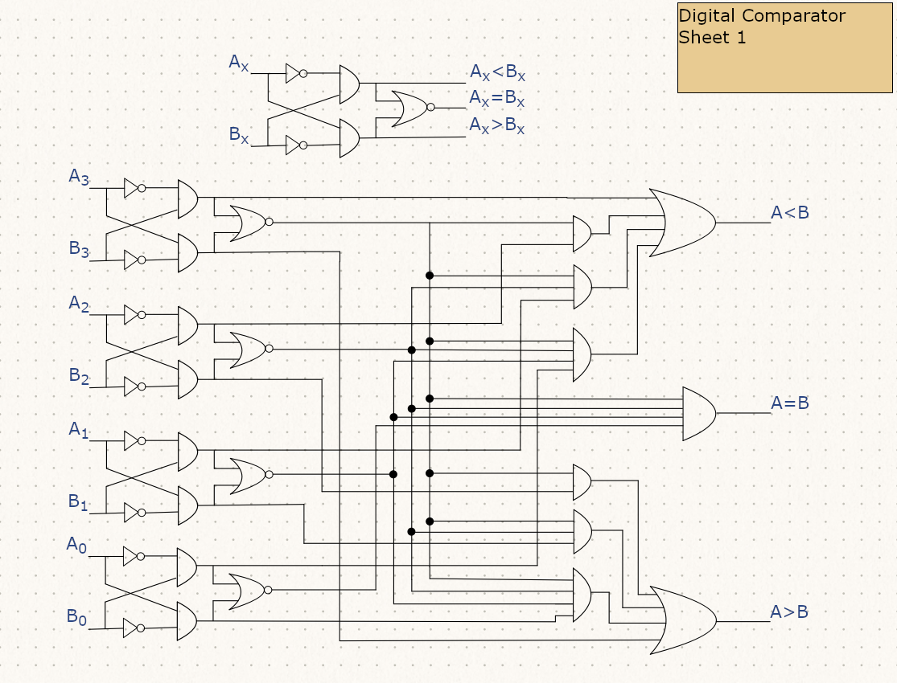
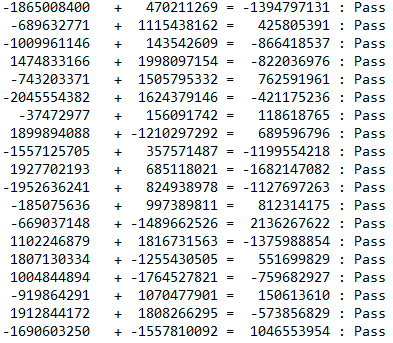
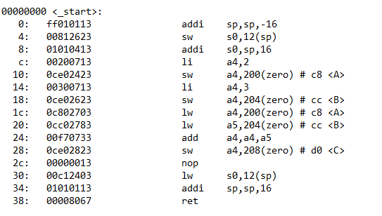
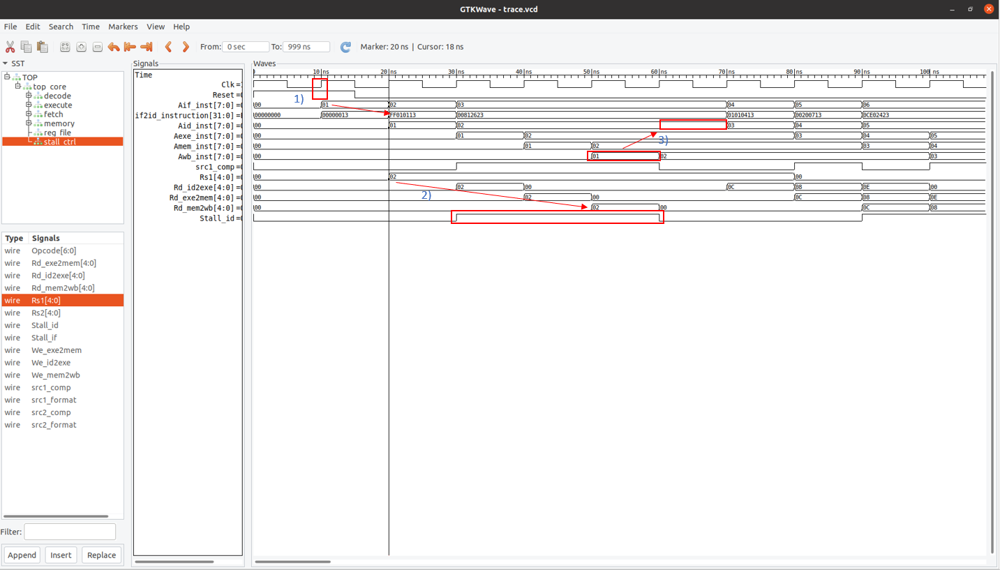
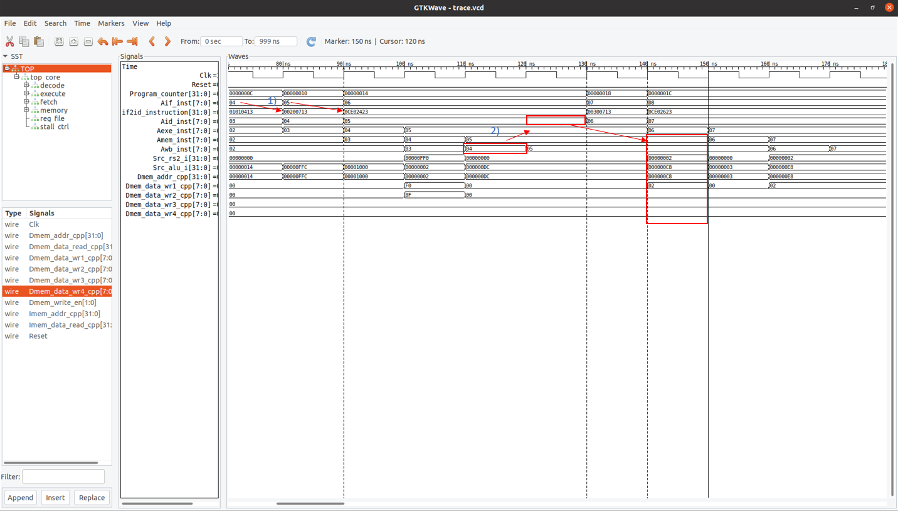
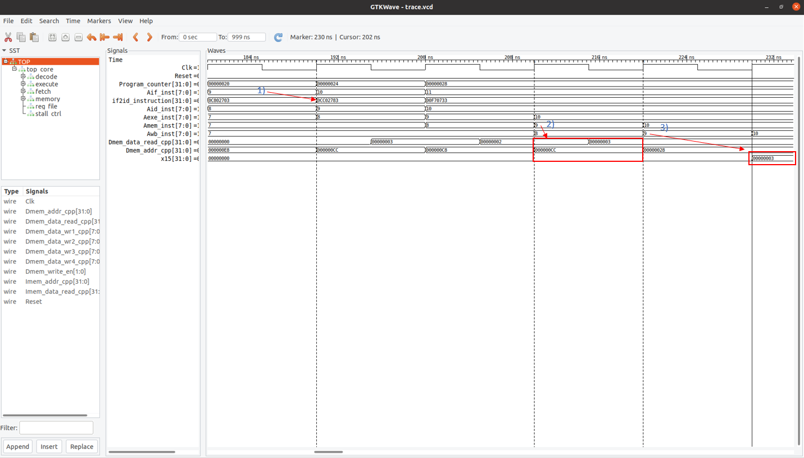
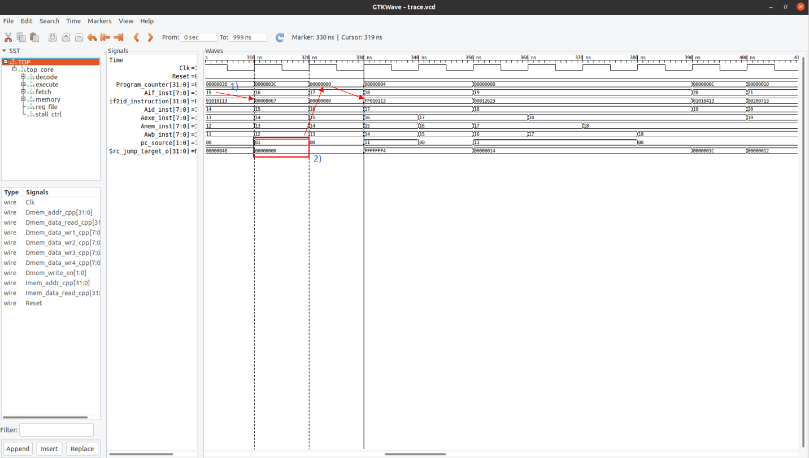

# riscv32i_w1
 <strong> Contents </strong>  
<ol>
  <li> Schematics </li>  
  <li> Compliance Tests </li>
  <li> The ALU Test </li>
 <li The Sample C Program Test </li>
</ol>

<strong> Schematics </strong>   
IF_Stage:  

   
ID_Stage:  

   
EXE_Stage:  

   
MEM_Stage:  

   
ALU_i:  

   
Carry_Select_Adder:  

   
Barrel_Shifters:  

   
Digital Comparator:  

   
Sign_Extender:  

   

<strong> Compliance Tests </strong>  
Running the automation bash script for the compliance tests generates the following results.

<strong> The ALU Test </strong>  
I tested the ALU by generating random signed int values in the cpp wrapper module. The cpp wrapper performs the same ALU operations alongside the simulated verilog ALU. Both answers are compared and the result is written as a Pass or Fail to the alu_tests.txt file that generates in /Testbenches. If a test case fails, the mismatched result from the verilog ALU is also outputted. An example: 

 

<strong> The Sample C Program Test</strong>  
The following is the .text section of the ELF objdump from the example C program. Below are screenshots of the waveforms generated by running the C program on the core: 

 

Program entry and first hazard:
<ol>
  <li> After reset, instruction fetch stage is fetches the first instruction "ff010113" which is latched and evaluated by instruction decode stage in the following cycle. </li>  
  <li> Data dependency on the sp register (x2) between the first instruction and the second instruction. The core stalls. </li>
  <li> Instruction decode stage can proceed only after the dependency has cleared the writeback stage. </li>
</ol>

 

A store instruction and hazard:
<ol>
  <li> Instruction fetch stage is fetching instruction 4 (PC at 0x8) followed by instruction 5 (PC at 0xC). </li>  
  <li> Instruction 5 has a dependency on instruction 4 over the a4 (x14) register. Instruction 4 must commit to write back stage before instruction 5 can proceed in the decode stage in the following cycle. Instruction 5 propogates 2 more cycles into the memory stage, and the correct memory address and write data appears in that cycle. </li>
</ol>

 

A load instruction:
<ol>
  <li> Load instruction "0CC02783" (PC at 0x20) is fetched and decoded. </li>  
  <li> Mem stage sets the correct Dmem address and the "memory" responds in same cycle with the result. </li>
  <li> Result loaded from memory is commited in the writeback stage and can be seen updated in the destination register in the following cycle. </li>
</ol>

 

A jump instruction and program "exit":
<ol>
  <li> Final instruction at PC = 38 is fetched. </li>  
  <li> Decode stage recognizes a jump instruction, calculates the jump target and routes the PC source accordingly. A NOP injects into the decode stage as the fetch stage flushes and retrieves the next instruction. The jump target points back to the beginning of our program. </li>
</ol>

The data memory following the execution of the program is exported to a text document which evaluates to the correct value of "C = A+B" that was ran in the program.
